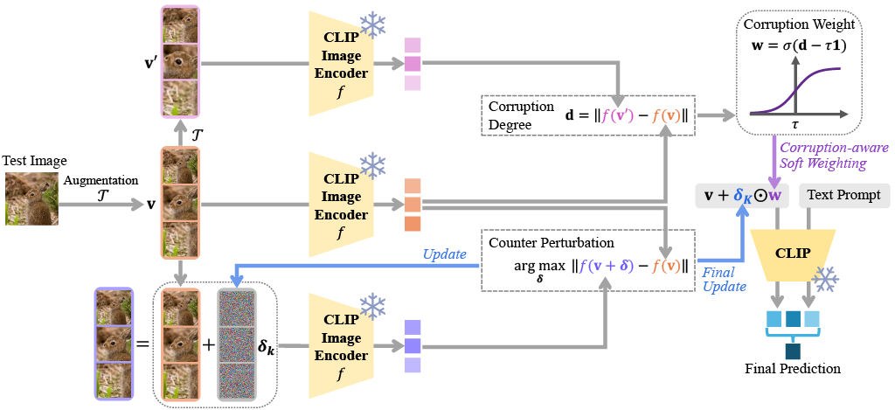

# MAC: Multi-View Guided Adaptive Counterattacks for Test-Time Adversarial Robustness (CVPR 2026)

Official PyTorch implementation of the CVPR 2026 paper: **"When CLIP Sees More, It Fights Back Harder: Multi-View Guided Adaptive Counterattacks for Test-Time Adversarial Robustness"**.

## 📌 Overview



Vision-language models like CLIP exhibit remarkable zero-shot capabilities but remain highly vulnerable to adversarial perturbations. We propose **MAC** (Multi-view guided Adaptive Counterattack), a tuning-free test-time defense framework. 

MAC dynamically improves CLIP's robustness by:
1. Constructing multiple augmented views of an input image.
2. Performing multi-view guided counterattacks to steer corrupted embeddings toward reliable states.
3. Adaptively scaling the counterattack intensity using a corruption degree via corruption-aware soft weighting.
4. Aggregating the predictions from each counterattacked view to yield a robust final prediction.

MAC achieves state-of-the-art adversarial robustness while remaining extremely fast and memory-efficient.

## ⚙️ Dependencies

We recommend setting up a virtual environment. Below are the core dependencies required to run the code:

* `torch` (>= 2.0.0)
* `torchvision`
* `numpy==1.26.4`
* `scipy==1.14.1`
* `Pillow==11.1.0`
* `ftfy==6.3.1`
* `h5py==3.13.0`
* `tqdm==4.67.1`


## 📂 Dataset Preparation

Please follow [CoOp](https://github.com/KaiyangZhou/CoOp) and manually download the required datasets. 

Place the downloaded datasets into the `./data` directory and make sure to check/update the path of the json file in `fewshot_datasets.py`.

## 🚀 How to Run

We provide a bash script (`mac_test.sh`) to reproduce our test-time adversarial defense evaluations.

### Running the Evaluation
To execute the tests, simply run the bash script from the root of your project:

```bash
bash mac_test.sh
```

### Understanding the Script Variables

Inside `mac_test.sh`, you can modify several parameters to test different setups:
* `ARCH`: The CLIP backbone architecture (e.g., `"ViT-B/32"`, `"RN50"`).
* `TEST_ATTACK_TYPE`: The adversarial attack method evaluated against (e.g., `"pgd"`).
* `TEST_EPS`, `TEST_NUMSTEPS`, `TEST_STEPSIZE`: Parameters defining the strength of the incoming adversarial attack.
* `MAC_EPS`, `MAC_NUMSTEPS`: Hyperparameters defining the budget and iterations of the MAC defense counterattack.
* `NUM_VIEWS`: The number of augmented views generated by MAC.
* `TEST_SET`: A string listing the datasets to evaluate on (e.g., `"Caltech101 DTD Flower102"`).

The script will automatically create a timestamped output directory under `MAC_results/` and save your evaluation results there.

## 📖 Citation

If you find our work helpful for your research, please consider citing our paper:

```bibtex
@inproceedings{kim2026mac,
  title={When CLIP Sees More, It Fights Back Harder: Multi-View Guided Adaptive Counterattacks for Test-Time Adversarial Robustness},
  author={Kim, Sunoh and Um, Daeho},
  booktitle={Proceedings of the IEEE/CVF Conference on Computer Vision and Pattern Recognition (CVPR)},
  year={2026}
}
```
